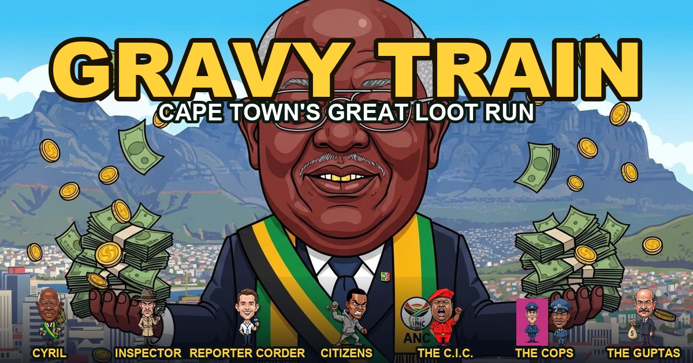
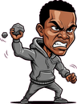

<!-- GRAVY TRAIN — README. Deliberately anonymous: no author, no tracking, no build step. -->

  

<h1 align="center">🚂 GRAVY TRAIN 🇿🇦</h1>

<b><i>Cape Town's Great Loot Run.</i></b> Grab the loot. Dodge the press. Beat the cabal. Stuff the couch.

  
  
  
  
  

  <b>👉 <a href="https://gravytrainza-code.github.io/">gravytrainza-code.github.io</a> 👈</b> 
  One link. No download, no sign-up, no app store. Works on any phone or laptop. Share it on WhatsApp.

---

## ⚡ At a Glance

| You want… | GRAVY TRAIN gives you… |
|---|---|
| **A laugh** | A satirical run through South Africa's greatest hits of looting — every "💰" block is a real, documented scandal |
| **To just play** | Tap the link. It loads in a second and runs offline. No install needed |
| **A challenge** | 7 zones of recognisable Cape Town, a press pack on your tail, police roadblocks, a state-capture boss, and one hidden extra life |
| **To share it** | Built to fly down a WhatsApp thread — a poster, a one-line summary, and a link |
| **Privacy** | Zero ads. Zero trackers. Zero accounts. Nobody's name on it |

---

## 🎮 The Run

You're **the President**. The takings of a generation are scattered across the Mother City, and the Commission is closing in. Run west to east — from the City Bowl to the estate — and bank it all in the couch before the story breaks.

- **🏃 Tight platforming** — run, sprint, coyote-time jumps, stomp your pursuers, head-bump the loot blocks.
- **💰 12 loot blocks, 12 real scandals** — Arms Deal, VBS, Eskom, Transnet, Bosasa, the lot. Each one's a unique block worth a fortune.
- **🛣️ The N1 gauntlet** — police roadblocks skim your cash (ramp over them), labelled potholes, dodgeable minibus taxis.
- **🏙️ Branching routes** — risk the Muizenberg rooftops for bonus coins, or play the street below.
- **✈️ The Dubai warp** — catch the private jet past the sealed vault and it flies you *back in* for a stash, the only **immunity** power-up, and the only **extra life** in the game.
- **🛋️ The Phala-Phala finish** — beat the boss for the key, then stuff every last rand into the sofa.

---

## 🎭 The Cast

> A caricature gallery, grounded entirely in public record. Archetypes, not accusations.

| | Character | Role |
|:--:|---|---|
|  | **CYRIL** | You. The president on the great loot run. |
|  | **REPORTER CORDER** | The reporter. Catch his story and you're BUSTED. |
|  | **THE INSPECTOR** | The watchdog patrolling the streets. |
|  | **THE C.I.C.** | The red-beret firebrand, rallying the bridge. |
|  | **THE CITIZENS** | Fed up. Throwing rocks from the overpass. |
|  | **THE COPS** | The roadblock. They'll take their cut. |
|  | **THE GUPTAS** | The state-capture cabal. The final boss. |

---

## 🕹️ How to Play

**On a phone** — on-screen buttons: **◀ ▶** to move, **RUN** to sprint, **JUMP** to leap.

**On a laptop**
| Action | Keys |
|---|---|
| Move | `←` `→` or `A` `D` |
| Jump | `Space` · `↑` · `W` |
| Sprint | hold `Shift` |

Stomp enemies from above. Head-bump the **💰** blocks to make it rain. Don't fall in the pits. Eight… er, **four lives** — find the fifth in Dubai.

---

## 💎 Why it exists

> **Everything you need. Nothing you don't.**

A throwaway link should be able to carry a full game and a sharp joke. GRAVY TRAIN is a single self-contained HTML file — no engine, no framework, no build pipeline, no analytics — that boots instantly on a cheap phone and tells a very South African story. Political satire of public figures is a long, proud local tradition; this is a cartoon in that lineage, built from the public record.

---

## 🔧 Under the Hood

- **One file.** Self-contained HTML/CSS/JS with a hand-rolled Canvas 2D engine. No dependencies, no build step.
- **Installable PWA.** Add to home screen; plays offline.
- **Procedural audio.** All sound is synthesised in the Web Audio API — including a chiptune of the public-domain anthem melody. No audio files.
- **Tiny.** The whole game is a single page that loads in well under a second.
- **Static hosting.** Plain GitHub Pages. A lightweight global play-counter runs on the edge.

---

## 🤝 Contributing & Use

Open an issue or a PR — gameplay tweaks, balance, new zones, bug fixes all welcome. Keep it anonymous: **no real names, no personal data, no tracking** in any contribution.

## 📜 License

Released into the public domain under **[The Unlicense](LICENSE)** — do whatever you like with it. No rights reserved, and no author to credit.

---

  <b>🇿🇦 Made anonymously, somewhere in South Africa. 🇿🇦</b> 
  <a href="https://gravytrainza-code.github.io/"><b>▶ Play GRAVY TRAIN</b></a>

